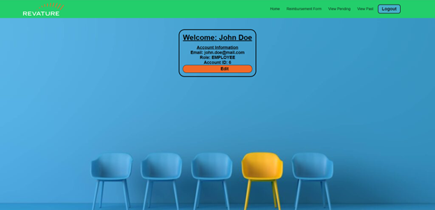

# Employee Reimbursement System

## Description

The Expense Reimbursement System (ERS) will manage the process of reimbursing employees for expenses incurred while on company time. All employees in the company can login and submit requests for reimbursement and view their past tickets and pending requests. Finance managers can log in and view all reimbursement requests and past history for all employees in the company. Finance managers are authorized to approve and deny requests for expense reimbursement.

## Technologies Used

- Java 8
- JDBC
- PostgreSQL
- Javalin
- Log4j
- JUnit
- Mockito
- React
- Redux
- Typescript
- HTML
- CSS

## Features

### Regular Users

- Log in and out
- View employee homepage
- Submit a reimbursement request
- View pending reimbursement requests
- View resolved reimbursement requests
- View account information
- Update account information

### Managers

- View manager homepage
- Approve/deny pending reimbursement requests
- View all pending requests of all employees
- View all resolved requests of all employees
- View reimbursement requests of a specific employee
- View all employees

## Getting Started

### Setting up the repository

Create a gitbash terminal in the directory where you want to store the repository and run the following commands:

```
git clone
cd ./employee-reimbursement-system/ers-frontend
npm install
```

### Setting up the database

- Create a database in the SQL client software application of your choice (DBeaver was used in this project)
- Create the necessary tables by running the following queries:

```
create table reimbursement_status (
	status_id int primary key generated always as identity,
	status varchar(64)
);

create table reimbursement_type (
	type_id int primary key generated always as identity,
	type varchar(64)
);

create table reimbursement (
	reimbursement_id int primary key generated always as identity,
	amount numeric not null,
	submitted_date date not null,
	resolved_date date,
	description varchar(128), 
	reimbursement_author int references users(user_id), 
	reimbursement_resolver int references users(user_id),
	reimbursement_status int references reimbursement_status(status_id), 
	reimbursement_type int references reimbursement_type (type_id)
);

create table users (
	user_id int primary key generated always as identity,
	username varchar(64),
	password varchar(25),
	first_name varchar(28),
	last_name varchar(28),
	email varchar(64),
	role int references user_roles(role_id)
);

create table user_roles ( 
	role_id int primary key,
	role varchar(28) unique
);
```

### Starting the Application

- On the command line, open the folder containing 

## Usage

### Logging In/Registering

The first page the user will view is the login page. To login, enter your username and password into the corresponding fields. To register a new user, click the yellow "Register" button.


On the registration page, enter your information into the designated fields. All fields in this form are required. Note: This form will only register an employee; managers must be created manually in the database (see the "Creating a Manager" section below).


### Homepage

After logging in, the user will be redirected to the homepage.



### Editing Account Information

To edit the user's account information, click on the orange "Edit" button; the user will be redirected to the Edit Account Information page.


Enter the new information into the corresponding fields. To submit, click the orange "Submit" button. To cancel and go back to the homepage, click the orange "Cancel" button.

### Submitting a New Reimbursement

To submit a new reimbursement, click "Reimbursement Form" on the green navigation bar at the top.


Enter the information for the reimbursement into the form and click the "Submit" button. Note: You will not automatically be redirected to the homepage. To go back to the homepage, click "Home" on the navigation bar.

### Viewing Pending Reimbursements

To view a user's pending reimbursement requests, click "View Pending" on the navigation bar.


### Viewing Resolved Reimbursements

To view a user's resolved reimbursement requests, click "View Resolved" on the navigation bar.


### Manager: Viewing and Approving/Denying Pending Reimbursements

The manager will have a different navigation bar from regular employees. To view all reimbursement requests from all employees as a manager, click "View All Pending" on the navigation bar.


To approve a request, click on the check mark on the right side of the table. To deny a request, click on the X.

### Manager: Viewing All Resolved Reimbursements

To view all resolved reimbursement requests from all employees, click "View All Resolved" on the navigation bar.


### Manager: Viewing All Employees

To view all employees, click "View All Employees" on the navigation bar.


## Logging Out

To log out, click on the blue "Logout" button in the navigation bar. You will be redirected to the login page.

### Creating a Manager

Managers can only be created manually in the database. To do so, run the following SQL query, replacing placeholders with the correct information:

```
insert into users (username, password, first_name, last_name, email, role) values ('[username]', '[password]', '[First Name]', '[Last Name]', '[email]', 1);
```

## Contributors

- Hailey "Yue" McNelis (yuemcn)
- Robert Duong (robpduo)
